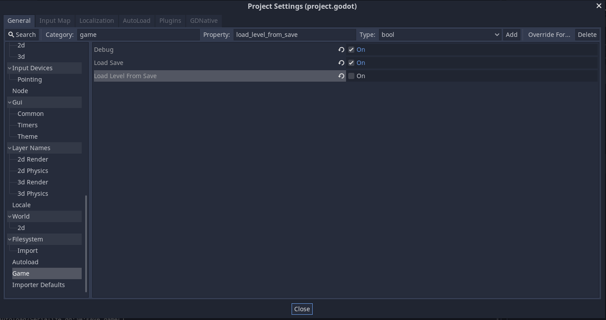
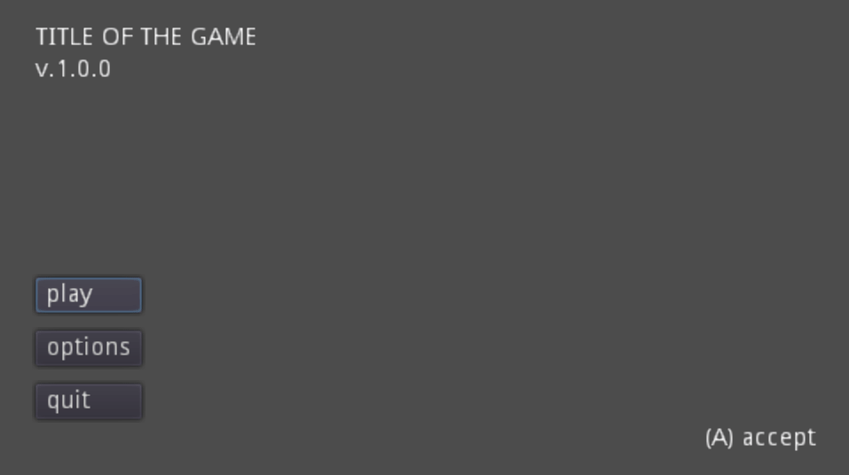
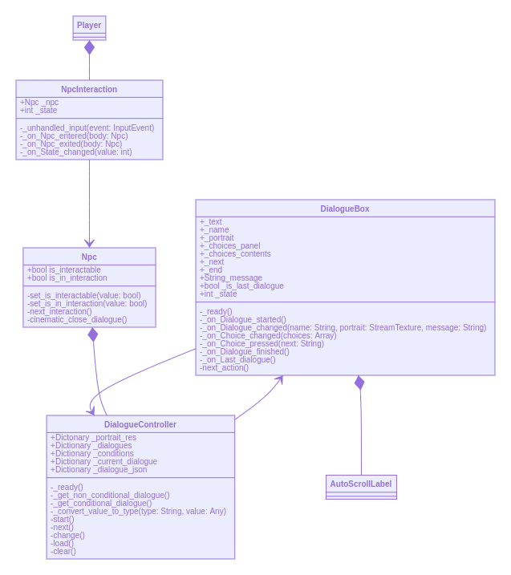

# Levrault's 2D platformer starter

This is my custom starter project to quickly create a 2D platformer. Feel free to use it to start your own project. Just keep in mind it has been made to suit my way of developing but I think you can maybe find some useful tips.

The project contains

- Navigable menu interface with screen transition. 
- Translatable interface
- Persistent settings menu (video, audio, key binding, language etc.)
- A ready to use Hierarchical state machine based on [GDQuest course](https://gdquest.mavenseed.com/courses) with basic move set (move, jump, run, attack)
- Castlevania navigation style rooms based level. A level is composed of multiples small rooms (scene), they are all loaded in memory and character can navigate through them)
- A branch dialogue system
- Unlockable abilities
- Save/Load system


## Guidelines

See [GDQuest's best practices guide](https://www.gdquest.com/docs/guidelines/best-practices/) and [official Gdscript Guidelines](https://docs.godotengine.org/en/3.2/getting_started/scripting/gdscript/gdscript_styleguide.html#code-order)

The only main difference, is own I approach the return behavior. I prefer make earlier return (to reduce nesting) instead of keeping only one value to return at the end. This is based on my [goland experience](https://dave.cheney.net/practical-go/presentations/qcon-china.html#_return_early_rather_than_nesting_deeply)


## Folder's Structure

I tried to make my project structure clear as possible. An `assets` folders for every resources (sprites, audio, json files) and a `src` folder to contains the code and game logics.

The only rules insides the `src` folders is that, every kinds of UI, GUI, go inside the `Interfaces` folders and every singletons goes on the `Autoload` folder.

The rest is divided between roles and code design decision.


## Debug settings

I add multiple project settings that you can find under `Project > Project Settings > Game`.  To check what a variable do, find it with`ProjectSettings.get_setting("game/[the variable name]")` in the code. 



*Screenshot can be outdated*


## Menu

### Layout

Every menu interface should inherit from a Layout (you can create has much layout as you want). By my experience with interface, is way easier to update multiple interfaces this way.

### Navigation

The navigation between each interface is manager with three script

- NavigationRouter: root node that will contains all interface, it will search to next interface to display and manage the navigation history

- NavigationSwitch: Every interface (e.g. title screen menu, options list, video options). Is updated when the route changed.

- NavigationButton: Send an unique id (the switch name) when clicked, create the navigation


### Animation Transition

When a navigation occur, 3 signals are used to indicate the state of the animation

- signal transition_started(anim_name)
- signal transition_mid_animated
- signal transition_finished

For the moment, they are used to display/hide the menu




## Dialogue

I try to create a flexible dialogue system. Here how it working

- `NpcInteraction` control player behavior and manage communication with the NPC
- `NPC` will communicate with `DialogueController`
- `DialogueController` will everything about the dialogue of the NPC
  - Load and search json file
  - Set all portrait in memory
  - Communicate with the `DialogueBox` scene
- `DialogueBox` manage all the visual of the dialogue
  - Choices
  - Scrolling
  - Communicate with `DialogueController` about his own state




 <video src="/home/luc/Devs/godot-2D-platformer-template/docs/dialogues_demo.mp4"></video>


### JSON file

JSON file should be places inside `res://assets/dialogues/` and should share the same name of the NPC's node name. 

e.g. `Jack` will use `Jack.json` file.


#### json:key

You can call it a key or an identifier.  

e.g. `001` is the key but you can call it `branch1` if you want. But it needs to be unique inside the file.

```json
"001": {
	"name": "NPCDummy",
	"portrait": "NPCDummy",
	"text": {
		"en": "Ready to do some sweet choices?",
		"fr": "T'es prêt à faire ton choix?"
	},
},
```


#### json:name

Character who spokes  

```json
"name": "Jean-Michel"
```


#### json:portrait

Name's file of the portrait to display can be change to multiples expressions through the dialogue   

```json
"portrait":"Jean_Michel_happy"
```


#### json:text  

Text to display. Translation are made with locale to text association  

```json
"text" :{ 
    "en": "hello world!",
    "fe": "Bonjour le monde!"
}  
```

 

#### json:choices (optional)  

Array of choice composed of the next branch and the text.  

```json
"choices": [
	{
		"text":{
			"en": "choice 1",
            "fr": "Choix 1"
		},
        "next": "002"
	},{
		"text":{
			"en": "choice 2",
            "fr": "Choix 2"
		},
        "next": "003"
	}
]  
```


#### json:conditions (optional)  

Object of conditions that will display this dialogue instead of the other one. Those conditions are set on `Npc.tscn`

If the Npc `has has_already_been_meet` to true, `001` will be displayed. If not, it will be `002`

```json
{
  "001": {
    "conditions": {
      "has_already_been_meet": true
    },
    "name": "NPCDummy",
    "portrait": "NPCDummy",
    "text": {
      "en": "Why some conditionals stuff, I was able to answer this",
      "fr": "Avec des conditions, j'ai pu te répondre ça"
    }
  },
  "002": {
    "name": "NPCDummy",
    "portrait": "NPCDummy",
    "text": {
      "en": "We have never meet before!",
      "fr": "Nous ne nous sommes jamais rencontré!"
    }
  }
}
```

Those are `AND inclusive`, I mean that if 

```python
var conditions = {
	"has_been_already_meet": true,
	"has_been_kind": true
}
```

is so inside `Npc.tscn` and we got the following json file

```json
{
  "001": {
    "conditions": {
      "has_already_been_meet": true
    },
    "name": "NPCDummy",
    "portrait": "NPCDummy",
    "text": {
      "en": "Why some conditionals stuff, I was able to answer this",
      "fr": "Avec des conditions, j'ai pu te répondre ça"
    }
  },
  "002": {
    "conditions": {
      "has_already_been_meet": true,
      "has_been_kind": true
    },
    "name": "NPCDummy",
    "portrait": "NPCDummy",
    "text": {
      "en": "We have never meet before!",
      "fr": "Nous ne nous sommes jamais rencontré!"
    }
  }
}
```

It will be the second option `002` that will be chosen since both of the conditions are rights. 

*Note: After adding all matching conditionals dialogue, non conditional will be added. Can be easier to maintain that force conditions to all dialogue.*


#### json:next (optional)  

The next dialogue to display. If the script does not find it, it consider that this is the final dialogue.

```json
{
  "001": {
    "name": "NPCDummy",
    "portrait": "NPCDummy",
    "text": {
      "en": "Why some conditionals stuff, I was able to answer this",
      "fr": "Avec des conditions, j'ai pu te répondre ça"
    },
    "next":"002",
  },
  "002": {
    "name": "NPCDummy",
    "portrait": "NPCDummy",
    "text": {
      "en": "We have never meet before!",
      "fr": "Nous ne nous sommes jamais rencontré!"
    }
  },
  "002": {
    "name": "NPCDummy",
    "portrait": "NPCDummy",
    "text": {
      "en": "arf",
      "fr": "Arf"
    }
  }
}
```


Will display `001` and `002` but not `003` since `002` does not have a next props.


#### json:signals (optional)

If at some specific points, you needs to trigger some event, you will need to use the `signals` props. I consider keeping the signals [Autoload Pattern](https://www.youtube.com/watch?v=S6PbC4Vqim4) to trigger those events.

##### Managing parameters and type

If you are not used to json we are limited to the number of types. Type like Vector and Node doesn't exist in json. The way I overcome this issue, is by 

- Signal **without parameter** are set with a `null` value 
- Signal **with parameter** are set as `Dictionary` in the shape of `type` => `value` 

```json
"signals": {
    "npc_script_event_started": null,
    "notification_started": {
    	"String": "dialogue generate event"
	},
	"camera_offset_changed": {
    	"Vector2": {
     	   "x": 200,
     	   "y": -400
    	}
	}
},
```

Doing that way, I let me translate the key to a real Godot supported type.

```python
func _convert_value_to_type(type: String, value):
	match type:
		"Vector2":
			return Vector2(value["x"], value["y"])

	return value
```


#### json:timer (optional)  

Can display an non-player controlled dialogue that will terminated itself after timer's value, he used for one unique dialogue. Value is in second. 

<Mark>Will not use the next value, can only show one dialogue at the time</Mark>

```json
  "001": {
    "name": "Player",
    "portrait": "Player",
    "text": {
      "en": "I can now double jump",
      "fr": "Je peux maintenant sauter une deuxieme fois"
    },
    "timer": 5
  }
```


## Unlock Ability

Player abilities are contained inside his `abilities` variable. It simple dictionary with bool data ( e.g.`double_jump = false`). To unlock a new ability, the player must collect a `UnlockAbility` (see `UnlockAbility.tscn`) item (I keep it to his simplest form so It can be customize to your need easily) to update his `abilities` dictionary and enable him to do the new action.

When the player collect a new ability, a check is made inside his state machine to check if the action can be done.

```python
if owner.abilities["double_jump"]:
	max_jump_count = 2
```
Since in almost all metroidvania game, when an ability is acquired, you cannot acquired it again (logic), that why the `UnlockAbility.tscn` are linked to the save file. If the player already has the ability, the scene free itself at loading.

