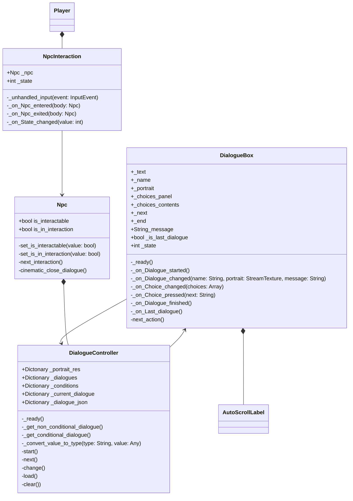

```mermaid
classDiagram
      DialogueBox --> DialogueController
      DialogueBox *-- AutoScrollLabel
      DialogueController --> DialogueBox
      Player *-- NpcInteraction
      NpcInteraction --> Npc
      Npc *-- DialogueController
      
      class NpcInteraction{
          +Npc _npc
          +int _state
          -_unhandled_input(event: InputEvent)
          -_on_Npc_entered(body: Npc)
          -_on_Npc_exited(body: Npc)
          -_on_State_changed(value: int)
      }
      class DialogueBox{
        +_text 
        +_name
        +_portrait
        +_choices_panel
        +_choices_contents
        +_next
        +_end
        +String_message
        +bool _is_last_dialogue
        +int _state
      	-_ready()
      	-_on_Dialogue_started()
      	-_on_Dialogue_changed(name: String, portrait: StreamTexture, message: String)
      	-_on_Choice_changed(choices: Array)
      	-_on_Choice_pressed(next: String)
      	-_on_Dialogue_finished()
      	-_on_Last_dialogue()
      	-next_action()
      }
      class Player{
      }
      class Npc{
      	+bool is_interactable
      	+bool is_in_interaction
      	-set_is_interactable(value: bool)
      	-set_is_in_interaction(value: bool)
      	-next_interaction()
      	-cinematic_close_dialogue()
      }
      class DialogueController{
      	+Dictonary _portrait_res
      	+Dictionary _dialogues
      	+Dictionary _conditions
      	+Dictionary _current_dialogue
      	+Dictionary _dialogue_json
      	-_ready()
      	-_get_non_conditional_dialogue()
      	-_get_conditional_dialogue()
      	-_convert_value_to_type(type: String, value: Any)
      	-start()
      	-next()
      	-change()
      	-load()
      	-clear())
      }
```
